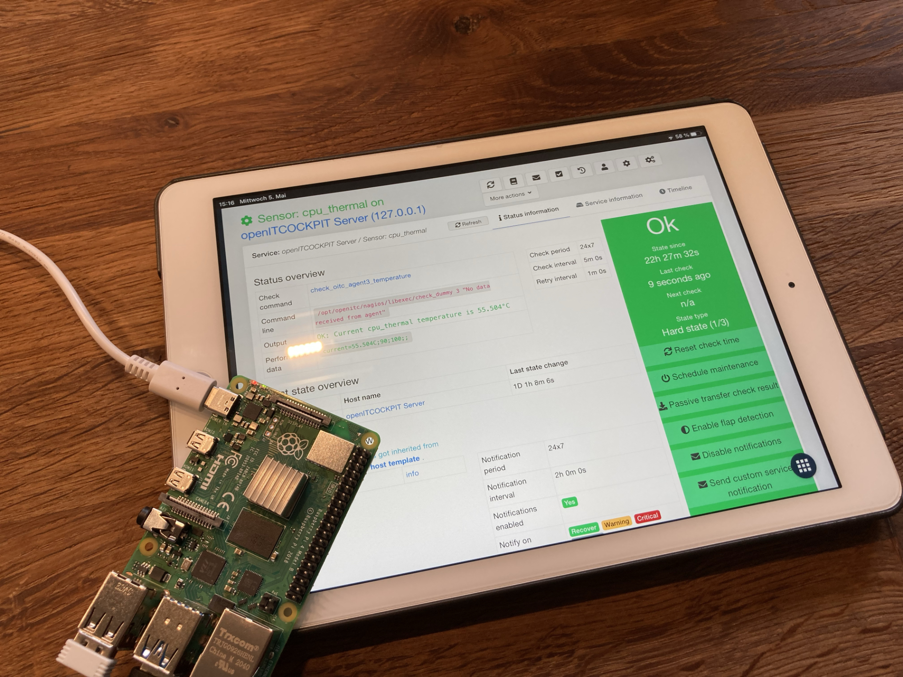

# About openITCOCKPIT

## What is openITCOCKPIT?

[openITCOCKPIT] (https://openitcockpit.io/) is a Monitoring Tool based on Nagios, Naemon and Prometheus.

 {align=center }

_Graphic: openITCOCKPIT installed on a Raspberry Pi 4_

## Demo

Would you like to try out openITCOCKPIT in an uncomplicated way? You are welcome to let off steam on our [Demo System](https://demo.openitcockpit.io/). This is reset daily.

## Safety

Please report any weaknesses and security gaps in openITCOCKPIT or software that is used by openITCOCKPIT to: [security@openitcockpit.io] (mailto: security@openitcockpit.io)

All known vulnerabilities can be viewed here: [https://openitcockpit.io/security/](https://openitcockpit.io/security/)

## Support

Professional assistance and support is offered by [it-novum GmbH](https://it-services.it-novum.com/support-2/).

### Community

- Official [Discord Server](https://discord.gg/G8KhxKuQ9G)
- [#openitcockpit](https://web.libera.chat/#openitcockpit) IRC channel on Libera Chat

## License

openITCOCKPIT and the documentation are under a dual license:

```
Copyright (C) 2015-2020 it-novum GmbH


openITCOCKPIT is dual licensed

1)
This program is free software: you can redistribute it and / or modify
it under the terms of the GNU General Public License as published by
the Free Software Foundation, version 3 of the License.


This program is distributed in the hope that it will be useful,
but WITHOUT ANY WARRANTY; without even the implied warranty of
MERCHANTABILITY or FITNESS FOR A PARTICULAR PURPOSE. See the
GNU General Public License for more details.


You should have received a copy of the GNU General Public License
along with this program. If not, see <http://www.gnu.org/licenses/>.

2)
If you purchased an openITCOCKPIT Enterprise Edition you can use this file
under the terms of the openITCOCKPIT Enterprise Edition license agreement.
License agreement and license key will be shipped with the order
confirmation.
```
