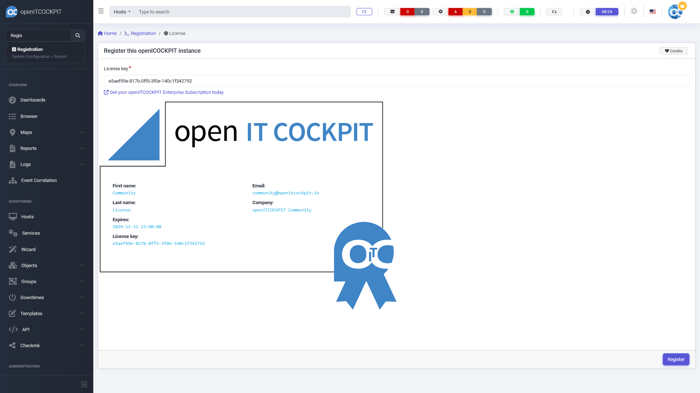

# Installation

Die Installation von openITCOCKPIT erfolgt über den Paketmanger der Linux-Distribution.

## Unterstützte Betriebssysteme

- Ubuntu
    - Focal (20.04)
    - Bionic (18.04)
- Debian
    - Buster (10)

## arm64 / Raspberry Pi
openITCOCKPIT und alle Komponenten stehen auch für arm64 Prozessoren und den Raspberry Pi zur Verfügung.

Die Installation unterscheidet sich dabei nicht von einem 64-Bit System mit AMD oder Intel Prozessor. Wenn Sie ein Raspberry Pi benutzen wollen muss die [64-Bit Version von Raspberry Pi OS](https://downloads.raspberrypi.org/raspios_arm64/images/) genutzt werden.

## Repository einbinden
### Ubuntu

```
add-apt-repository universe
apt-get install apt-transport-https curl gnupg2 ca-certificates
curl https://packages.openitcockpit.io/repokey.txt | apt-key add -

echo "deb https://packages.openitcockpit.io/openitcockpit/$(lsb_release -sc)/stable $(lsb_release -sc) main" > /etc/apt/sources.list.d/openitcockpit.list
apt-get update
```

### Debian

```
deb http://deb.debian.org/debian/ buster main contrib non-free
deb http://security.debian.org/debian-security buster/updates main contrib non-free
deb http://deb.debian.org/debian/ buster-updates main contrib non-free
```

```
apt-get install apt-transport-https curl gnupg2 ca-certificates
curl https://packages.openitcockpit.io/repokey.txt | apt-key add -

echo "deb https://packages.openitcockpit.io/openitcockpit/$(lsb_release -sc)/stable $(lsb_release -sc) main" > /etc/apt/sources.list.d/openitcockpit.list
apt-get update
```

## Installation von openITCOCKPIT
Die eigentliche Installation wird durch folgenden Befehl ausgeführt:
```
apt-get install openitcockpit
```

Im Anschluss muss noch die Grundkonfiguration durchgeführt werden. In diesem Schritt wird zum Beispiel der erste Benutzer für die Weboberfläche erstellt. Im Anschluss erfolgt die restliche Konfiguration über das openITCOCKPIT Webinterface.

```
/opt/openitc/frontend/SETUP.sh
```

## Registrierung der openITCOCKPIT Community Edition

Dieser Schritt ist freiwillig und optional. Der Funktionsumfang von openITCOCKPIT kann durch Module erweitert werden. Einige stehen kostenlos zur Verfügung. Um Zugriff auf die Communitymodule zu erhalten, muss zuerst der openITCOCKPIT Community Schlüssel eingegeben werden. Rufen Sie dazu `System -> Registration` auf und fügen Sie folgenden Schlüssel ein: `e5aef99e-817b-0ff5-3f0e-140c1f342792`. 

Es werden keine weiteren Angaben benötigt.

{ align=center }

Nach erfolgreicher Aktivierung stehen Ihnen die Community Module unter `System Tools -> Package Manager` zur Verfügung.

## Installation von phpMyAdmin

Dieser Schritt ist freiwillig und optional. openITCOCKPIT nutzt eine MySQL Datenbank. Normalerweise hat der Endanwender keine Berührungspunkte mit der Datenbank. Erfahrene Benutzer können zur Verwaltung der Datenbank das Tool `phpMyAdmin` installieren.

```
apt-get install phpmyadmin
```

Die Konfiguration des Webservers wird automatisch durchgeführt. Die phpMyAdmin Oberflächje ist im Anschluss über `https://xxx.xxx.xxx.xxx/phpmyadmin` erreichbar.

## Systemanforderungen

- Ubuntu Linux 64 bit (20.04 LTS "Focal" und 18.04 LTS "Bionic"), Debian Linux 64 bit (10 "Buster")
- 2 CPU Kerne (x86-64 oder arm64)
- 2 GB RAM
- 20 GB freier Festplattenspeicher
